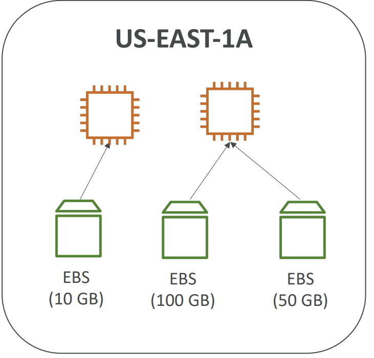

### What is EBS?

Amazon Elastic Block Store (EBS) is a high-performance block storage service designed for use with Amazon Elastic Compute Cloud (EC2) for both throughput and transaction-intensive workloads at any scale. Here’s an in-depth look at the fundamental aspects of EBS:

#### Block-Level Storage

- **Description**: EBS provides storage at the block level, similar to traditional disk drives. You can format these volumes with any file system and use them for a variety of applications.
- **Applications**: Particularly useful for databases, file servers, and any workload that requires persistent storage.

<!-- pagebreak -->

#### Scalability

- **Flexibility**: EBS volumes can be resized on the fly, allowing you to increase or decrease storage capacity without downtime.
- **Convenience**: This feature provides significant flexibility in managing storage resources according to your changing needs.

<!-- pagebreak -->

#### Durability and Redundancy

- **Reliability**: EBS volumes are automatically replicated within their Availability Zone to prevent data loss due to hardware failures.
- **High Availability**: This built-in redundancy ensures high durability and availability of your data.

<!-- pagebreak -->

#### Snapshots

- **Backup and Recovery**: EBS allows you to take point-in-time snapshots of your volumes, which are persisted to Amazon S3 for long-term durability.
- **Use Cases**: Snapshots can be used to restore volumes to a previous state or to create new volumes from an existing snapshot.

<!-- pagebreak -->

#### Additional Notes on EBS Usage

- **Single Attachment**: By default, an EBS volume can only be attached to one EC2 instance at a time. However, certain EBS volumes can be configured for multi-attach, enabling them to be attached to multiple instances simultaneously.
- **Mobility**: EBS volumes are tied to a specific Availability Zone and must be in the same AZ as the EC2 instance to which they are attached. However, they can be detached and reattached to other instances within the same AZ as needed.

**Note:** While EBS Multi-Attach enables a single volume to be attached to multiple instances, it is a more advanced feature typically not covered in a Developer Associate exam.

#### Multiple EBS Volumes on Single Instance

- **Capability**: Multiple EBS volumes can be attached to a single EC2 instance, providing expanded storage and enhanced performance capabilities.
- **Management**: Managing multiple EBS volumes involves ensuring proper configuration and handling within the EC2 instance to maximize efficiency and performance.

---
